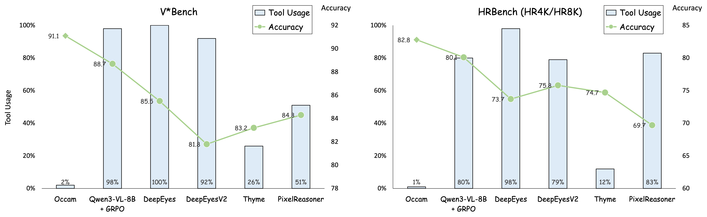
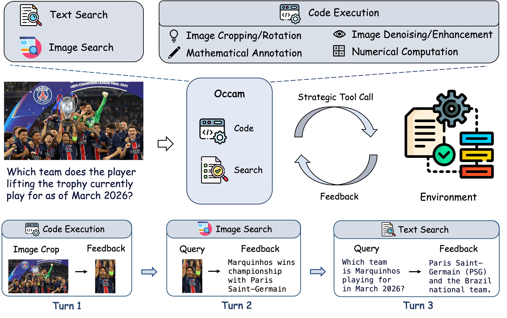
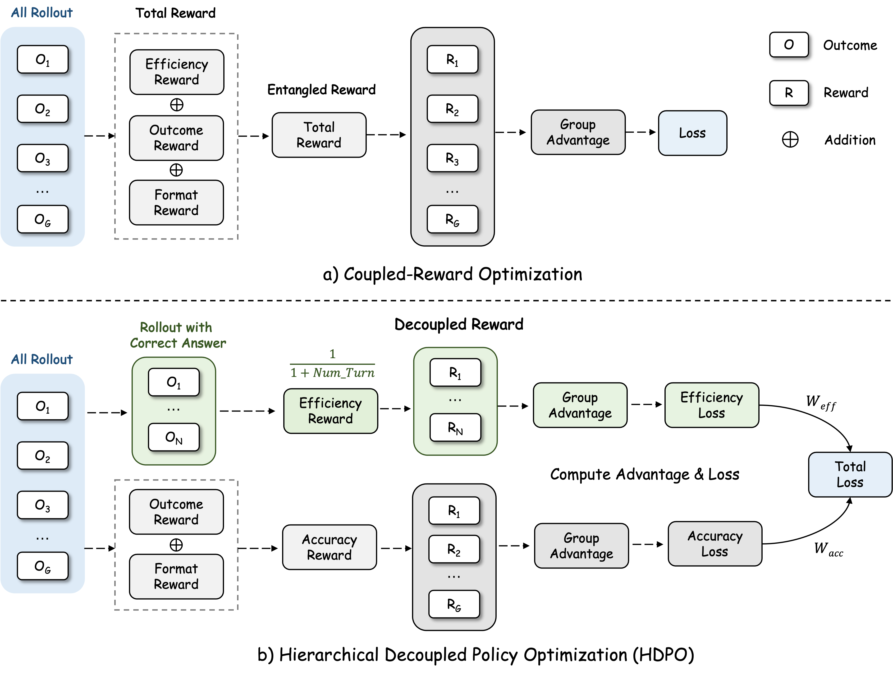

<p align="center">
  <h1 align="center">Metis: Cultivating Meta-Cognitive Tool Use<br>in Agentic Multimodal Models</h1>
</p>

<p align="center">
    <b><a href="https://scholar.google.com/citations?user=2VhjOykAAAAJ&hl=en">Shilin Yan</a><sup>1*†‡</sup>, <a href="https://scholar.google.com/citations?user=T-0oVM4AAAAJ&hl=en">Jintao Tong</a><sup>1,2*</sup>, <a href="https://scholar.google.com/citations?user=k5CJa5YAAAAJ&hl=zh-CN">Hongwei Xue</a><sup>1</sup>, Xiaojun Tang<sup>1</sup>, Yangyang Wang<sup>1</sup>,</b><br>
    <b>Kunyu Shi<sup>1</sup>, Guannan Zhang<sup>1</sup>, <a href="https://scholar.google.com/citations?user=scAIu2MAAAAJ&hl=en&oi=ao">Ruixuan Li</a><sup>2‡</sup>, <a href="https://scholar.google.com/citations?user=VXxF0mcAAAAJ&hl=en&oi=ao">Yixiong Zou</a><sup>2‡</sup></b><br>
    <sup>*</sup>Equal contribution &emsp; <sup>†</sup>Project Leader &emsp; <sup>‡</sup>Corresponding Author<br><br>
    <sup>1</sup>Accio Team, Alibaba Group &emsp; <sup>2</sup>Huazhong University of Science and Technology
</p>

<p align="center">
    <a href="https://Accio-Lab.github.io/Metis"></a>
    <a href="https://Accio-Lab.github.io/Metis"></a>
    <a href="https://github.com/Accio-Lab/Metis"></a>
    <a href="https://huggingface.co/Accio-Lab/Metis-8B-RL"></a>
    <a href="https://huggingface.co/datasets/Accio-Lab/Metis-RL"></a>
    <a href="https://huggingface.co/Accio-Lab/Metis-8B-ColdStart"></a>
    <a href="https://huggingface.co/datasets/Accio-Lab/Metis-ColdStart"></a>
</p>

<p align="center">
    
    
    
</p>

---

## 📰 News

- 🔥 **[2026/04/10]** Paper, code, and model weights released!

## ✨ Highlights

<table>
<tr>
<td width="33%" align="center">🎯 <b>98% → 2% Tool Calls</b><br><sub>Reduces blind tool invocation<br>by orders of magnitude</sub></td>
<td width="33%" align="center">📈 <b>SOTA Performance</b><br><sub>Best accuracy across 13 benchmarks<br>among open-source 8B agents</sub></td>
<td width="33%" align="center">🧠 <b>Meta-Cognitive Wisdom</b><br><sub>Learns <em>when</em> to use tools,<br>not just <em>how</em></sub></td>
</tr>
</table>

## 💡 Introduction

> *"The art of being wise is the art of knowing what to overlook."* — William James

Current agentic multimodal models suffer from a critical meta-cognitive deficit: **blind tool invocation** 🔧❌. They reflexively call external tools even when queries are directly resolvable from the visual context, leading to severe latency overhead and reasoning degradation.

Existing RL methods attempt to fix this by scalarizing accuracy and tool-efficiency rewards. However, this **coupled reward** formulation creates an irreconcilable optimization dilemma — aggressive penalties suppress essential tool use, while mild penalties are entirely washed out by accuracy reward variance during advantage normalization.

We propose **Hierarchical Decoupled Policy Optimization (HDPO)**, a framework that maintains two orthogonal optimization channels:
- 🎯 An **accuracy channel** that globally maximizes task correctness
- ⚡ An **efficiency channel** that enforces tool parsimony *exclusively within accurate trajectories*

This decoupled design naturally induces an **implicit curriculum** 📚 — *first learn to be correct, then learn to be efficient* — without any manual scheduling.

Our resulting model, **Metis**, reduces tool invocations by orders of magnitude (e.g., from 98% to 2%) while simultaneously elevating reasoning accuracy across diverse benchmarks.

<p align="center">
  
  <br>
  <em>Comparison of tool-use efficiency and task performance. Existing methods rely heavily on tool calls. Metis uses tools selectively while achieving the best overall performance.</em>
</p>

## 🔬 Metis Framework

<p align="center">
  
  <br>
  <em>Overview of Metis. A strategic multimodal reasoning agent that selectively invokes code execution, text search, and image search tools during multi-turn reasoning.</em>
</p>

HDPO resolves reward coupling through three key components:

### 1️⃣ Dual Reward Design

| Reward | Formula | Description |
|--------|---------|-------------|
| 🎯 Accuracy | r_acc = 0.9 · r_ans + 0.1 · r_fmt | Binary answer correctness + format compliance |
| ⚡ Tool Efficiency | r_tool = 1/(T+1) if correct, else 0 | Inverse penalty on tool invocations, **conditioned on correctness** |

### 2️⃣ Decoupled Advantage Estimation

- 🎯 **Accuracy advantage** — Standard GRPO over all *G* rollouts per prompt
- ⚡ **Tool efficiency advantage** — **Conditional GRPO** computed exclusively over the qualifying set *Q* = {correct rollouts with |*Q*| ≥ 2}

This prevents incorrect rollouts from inflating tool efficiency advantages and eliminates cross-objective gradient entanglement.

### 3️⃣ Hierarchical Policy Update

The final HDPO objective combines two independent clipped surrogate losses:

```
L_HDPO = w_acc · L_GRPO(A_acc) + w_tool · L_GRPO(A_tool)
```

Since advantages are normalized independently, each gradient component delivers a clean, orthogonal learning signal.

<p align="center">
  
  <br>
  <em>Comparison between coupled-reward optimization and HDPO. Existing methods entangle accuracy and efficiency into a single reward signal, while HDPO decouples them into separate branches.</em>
</p>

## 📊 Results

### 👁️ Perception and Document Understanding

<table>
<thead>
<tr>
<th align="left">Model</th><th align="center">V*Bench</th><th align="center">HR4K</th><th align="center">HR8K</th><th align="center">TreeBench</th><th align="center">MME-RW</th><th align="center">SEED2+</th><th align="center">CharXiv(DQ)</th><th align="center">CharXiv(RQ)</th>
</tr>
</thead>
<tbody>
<tr><td colspan="9" align="center"><em><b>Open-Source Models</b></em></td></tr>
<tr><td>LLaVA-OneVision</td><td align="center">75.4</td><td align="center">63.0</td><td align="center">59.8</td><td align="center">37.3</td><td align="center">57.4</td><td align="center">65.4</td><td align="center">-</td><td align="center">-</td></tr>
<tr><td>InternVL3-8B</td><td align="center">81.2</td><td align="center">70.0</td><td align="center">69.3</td><td align="center">38.8</td><td align="center">-</td><td align="center">69.7</td><td align="center">73.6</td><td align="center">37.6</td></tr>
<tr><td>Qwen2.5-VL-7B-Instruct</td><td align="center">75.3</td><td align="center">65.5</td><td align="center">62.1</td><td align="center">37.0</td><td align="center">56.8</td><td align="center">70.4</td><td align="center">72.7</td><td align="center">40.2</td></tr>
<tr><td>Qwen2.5-VL-32B-Instruct</td><td align="center">80.6</td><td align="center">69.3</td><td align="center">63.6</td><td align="center">42.5</td><td align="center">59.1</td><td align="center">72.4</td><td align="center">83.2</td><td align="center">48.0</td></tr>
<tr><td>Qwen3-VL-8B-Instruct</td><td align="center">86.4</td><td align="center">78.9</td><td align="center">74.6</td><td align="center">40.7</td><td align="center">61.9</td><td align="center">71.0</td><td align="center">83.0</td><td align="center">46.3</td></tr>
<tr><td colspan="9" align="center"><em><b>Agentic Multimodal Models</b></em></td></tr>
<tr><td>Pixel-Reasoner</td><td align="center">84.3</td><td align="center">72.6</td><td align="center">66.1</td><td align="center">39.0</td><td align="center">64.4</td><td align="center">-</td><td align="center">-</td><td align="center">-</td></tr>
<tr><td>DeepEyes</td><td align="center">83.3</td><td align="center">73.2</td><td align="center">69.5</td><td align="center">37.5</td><td align="center">64.1</td><td align="center">-</td><td align="center">-</td><td align="center">-</td></tr>
<tr><td>Thyme</td><td align="center">82.2</td><td align="center">77.0</td><td align="center">72.0</td><td align="center">-</td><td align="center">64.8</td><td align="center">-</td><td align="center">-</td><td align="center">-</td></tr>
<tr><td>DeepEyesV2</td><td align="center">81.8</td><td align="center">77.9</td><td align="center">73.8</td><td align="center">42.5</td><td align="center">64.9</td><td align="center">70.5</td><td align="center">78.6</td><td align="center">48.9</td></tr>
<tr><td>Mini-o3</td><td align="center">88.2</td><td align="center">77.5</td><td align="center">73.3</td><td align="center">-</td><td align="center">65.5</td><td align="center">-</td><td align="center">-</td><td align="center">-</td></tr>
<tr><td>SenseNova-MARS-8B</td><td align="center"><b>92.2</b></td><td align="center">83.1</td><td align="center">78.4</td><td align="center">-</td><td align="center">67.9</td><td align="center">-</td><td align="center">-</td><td align="center">-</td></tr>
<tr><td>Skywork-R1V4-30B-A3B</td><td align="center">88.0</td><td align="center">82.8</td><td align="center">79.8</td><td align="center">-</td><td align="center"><b>71.4</b></td><td align="center">-</td><td align="center">-</td><td align="center">-</td></tr>
<tr><td><b>Metis (Ours)</b></td><td align="center">91.1</td><td align="center"><b>83.5</b></td><td align="center"><b>82.0</b></td><td align="center"><b>45.2</b></td><td align="center">70.3</td><td align="center"><b>72.5</b></td><td align="center"><b>83.4</b></td><td align="center"><b>54.1</b></td></tr>
</tbody>
</table>

### 🧮 Mathematical and Logical Reasoning

<table>
<thead>
<tr>
<th align="left">Model</th><th align="center">MathVista</th><th align="center">MathVerse</th><th align="center">WeMath</th><th align="center">DynaMath</th><th align="center">LogicVista</th><th align="center">Avg.</th>
</tr>
</thead>
<tbody>
<tr><td colspan="7" align="center"><em><b>Open-Source Models</b></em></td></tr>
<tr><td>LLaVA-OneVision</td><td align="center">58.6</td><td align="center">19.3</td><td align="center">20.9</td><td align="center">-</td><td align="center">33.3</td><td align="center">-</td></tr>
<tr><td>Qwen2.5-VL-7B-Instruct</td><td align="center">68.3</td><td align="center">45.6</td><td align="center">34.6</td><td align="center">53.3</td><td align="center">45.9</td><td align="center">49.5</td></tr>
<tr><td>InternVL3-8B</td><td align="center">71.6</td><td align="center">39.8</td><td align="center">37.1</td><td align="center">-</td><td align="center">44.1</td><td align="center">-</td></tr>
<tr><td>Qwen3-VL-8B-Instruct</td><td align="center">76.3</td><td align="center">61.3</td><td align="center">38.8</td><td align="center">65.5</td><td align="center">54.9</td><td align="center">59.4</td></tr>
<tr><td colspan="7" align="center"><em><b>Text-only Reasoning Models</b></em></td></tr>
<tr><td>MM-Eureka-7B</td><td align="center">72.6</td><td align="center">50.3</td><td align="center">21.8</td><td align="center">-</td><td align="center">46.3</td><td align="center">-</td></tr>
<tr><td>ThinkLite-VL-7B</td><td align="center">75.1</td><td align="center">52.1</td><td align="center">41.8</td><td align="center">-</td><td align="center">42.7</td><td align="center">-</td></tr>
<tr><td>VL-Rethinker-7B</td><td align="center">74.9</td><td align="center">54.2</td><td align="center">36.3</td><td align="center">-</td><td align="center">42.7</td><td align="center">-</td></tr>
<tr><td>VLAA-Thinker-7B</td><td align="center">71.7</td><td align="center">-</td><td align="center">35.7</td><td align="center">-</td><td align="center">45.9</td><td align="center">-</td></tr>
<tr><td colspan="7" align="center"><em><b>Agentic Multimodal Models</b></em></td></tr>
<tr><td>DeepEyes</td><td align="center">70.1</td><td align="center">47.3</td><td align="center">38.9</td><td align="center">55.0</td><td align="center">47.7</td><td align="center">51.8</td></tr>
<tr><td>Thyme</td><td align="center">70.0</td><td align="center">-</td><td align="center">39.3</td><td align="center">-</td><td align="center">49.0</td><td align="center">-</td></tr>
<tr><td>DeepEyesV2</td><td align="center">71.9</td><td align="center">52.7</td><td align="center">38.1</td><td align="center">57.2</td><td align="center">48.7</td><td align="center">53.7</td></tr>
<tr><td><b>Metis (Ours)</b></td><td align="center"><b>78.0</b></td><td align="center"><b>65.9</b></td><td align="center"><b>65.2</b></td><td align="center"><b>69.2</b></td><td align="center"><b>56.2</b></td><td align="center"><b>66.9</b></td></tr>
</tbody>
</table>

### 🔍 Ablation: Effect of w_tool

| Method | V*Bench | HR4K | HR8K | CharXiv(RQ) | MathVista |
|--------|---------|------|------|-------------|-----------|
| Standard GRPO (w_tool=0) | 88.7 | 81.0 | 79.2 | 51.0 | 76.9 |
| HDPO (w_tool=0.10) | 88.0 | **83.5** | 81.0 | 52.7 | 77.4 |
| **HDPO (w_tool=0.15)** ✅ | **91.1** | **83.5** | **82.0** | **54.1** | **78.0** |
| HDPO (w_tool=0.20) | 87.4 | 82.5 | 80.5 | 51.5 | 77.2 |

### 🧠 Meta-Cognitive Tool Arbitration

To illustrate the meta-cognitive tool-use behavior cultivated by HDPO, we present two representative cases from the main paper.

<details open>
<summary>💭 <b>Case 1: Direct Reasoning — No Tool Needed</b></summary>
<br>

When the query is resolvable from the visual context and parametric knowledge alone, Metis abstains from calling any external tool and answers directly. The agent learns to trust its own capabilities for queries within its competence, avoiding the latency overhead and noise injection of redundant tool calls.

<p align="center">
  
  <br>
  <em>The query can be resolved through visual understanding and prior knowledge alone. Metis abstains from tool invocation and answers directly, exemplifying the meta-cognitive restraint instilled by HDPO.</em>
</p>
</details>

<details open>
<summary>🔬 <b>Case 2: Targeted Code Execution — Precision When Needed</b></summary>
<br>

When fine-grained visual analysis exceeds the model's native resolution capabilities, Metis strategically invokes code execution to crop and enlarge the relevant region. Code execution is not a default fallback, but a precision instrument deployed only when the visual evidence at the original resolution is genuinely ambiguous.

<p align="center">
  
  <br>
  <em>The question requires comparing curves in a specific subplot region difficult to resolve at the original image scale. Metis invokes code to crop and enlarge the relevant area, enabling precise identification of curve behavior near the queried time step.</em>
</p>
</details>

> 💡 **Takeaway:** Metis has internalized a principled decision boundary — abstaining when internal knowledge suffices, and selectively engaging external tools only when genuinely necessary.

## 🛠️ Installation

### 📋 Prerequisites

- 🐍 Python >= 3.10
- 🔧 CUDA >= 12.1
- 🖥️ 8× GPUs (80GB each, e.g. A100/H100) for RL training

### 📦 Install

```bash
git clone https://github.com/Accio-Lab/Metis.git
cd Metis

# Install verl (base RL framework) as editable dependency
pip install -e verl

# Install Metis (HDPO + tool server)
pip install -e ".[vllm,search_tool,python_code_dep]"
```

## 🚀 Quick Start

### 1️⃣ Deploy the Judge Model (Required)

During RL training, an **LLM judge** evaluates whether the agent's answers are correct. The reward manager (`metis.py`) calls an OpenAI-compatible endpoint to get `CORRECT` / `INCORRECT` verdicts.

You can deploy any strong LLM as the judge. We recommend using [vLLM](https://github.com/vllm-project/vllm):

```bash
# Deploy a judge model (on a GPU machine, e.g. 1× A100)
vllm serve \
    --model Qwen/Qwen3-235B-A22B-Instruct-2507 \
    --port 8000 \
    --tensor-parallel-size 8

# Verify it's running:
curl http://localhost:8000/v1/models
```

After the judge is up, note the URL (e.g. `http://<judge_ip>:8000/v1`). You will pass it as `JUDGE_BASE_URL` in Step 4.

> 💡 **Tip:** Any OpenAI-compatible server works (vLLM, SGLang, TGI, or even a commercial API like OpenAI / DeepSeek). Just set `JUDGE_API_KEY` and `JUDGE_BASE_URL` accordingly.

### 2️⃣ Configure the Search API (Required for text search tool)

The agent's **text search** tool calls a web search backend during training. You need an API key from **one** of the following providers:

| Provider | Env Variable | Sign Up |
|----------|-------------|---------|
| **Serper** (recommended) | `SERPER_API_KEY` | [serper.dev](https://serper.dev) |
| **SerpApi** | `SERPER_API_KEY` | [serpapi.com](https://serpapi.com) |
| **BrightData** | `BRIGHTDATA_API_TOKEN` + `BRIGHTDATA_ZONE` | [brightdata.com](https://brightdata.com) |

```bash
# Example: using Serper (default)
export SERPER_API_KEY="your-serper-api-key"
export SEARCH_PROVIDER="serper"        # "serper" | "serpapi" | "brightdata"
```

> 💡 **Tip:** If your training data does **not** contain search-type tasks, the search tool will not be invoked and you can skip this step.

### 3️⃣ Start the Tool Server (Optional)

The tool server provides sandboxed Python execution, text search, and image search capabilities for the agent.

> 💡 **Tip:** If you run training on a single node, you can **skip this step** — the training script will automatically start a local tool server. You only need to start it manually when deploying the tool server on a **separate dedicated machine**.

```bash
# On a dedicated machine (pass search API keys via environment)
SERPER_API_KEY="your-key" \
bash examples/train/start_tool_server.sh [PORT] [WORKERS]

# Example:
bash examples/train/start_tool_server.sh 30569 32
# After startup, the script will print:
#   URL: http://<server_ip>:30569/get_observation
# Save this URL for the next step.
```

### 4️⃣ Run HDPO Training

```bash
# Single node (8 GPUs) — tool server auto-starts locally
MODEL_PATH=path/to/your/sft-checkpoint \
TRAIN_DATA="[data/train.parquet]" \
VAL_DATA="[data/val.parquet]" \
JUDGE_BASE_URL=http://<judge_ip>:8000/v1 \
SERPER_API_KEY="your-serper-api-key" \
bash examples/train/train_metis.sh 0.15

# Single node with a remote tool server (started in Step 3)
MODEL_PATH=path/to/your/sft-checkpoint \
TRAIN_DATA="[data/train.parquet]" \
VAL_DATA="[data/val.parquet]" \
JUDGE_BASE_URL=http://<judge_ip>:8000/v1 \
REMOTE_TOOL_SERVER_URL=http://<server_ip>:<port>/get_observation \
bash examples/train/train_metis.sh 0.15

# Multi-node (Head node, e.g. 2 nodes)
NODE_RANK=0 NNODES=2 \
MODEL_PATH=path/to/your/sft-checkpoint \
TRAIN_DATA="[data/train.parquet]" \
VAL_DATA="[data/val.parquet]" \
JUDGE_BASE_URL=http://<judge_ip>:8000/v1 \
SERPER_API_KEY="your-serper-api-key" \
REMOTE_TOOL_SERVER_URL=http://<server_ip>:<port>/get_observation \
bash examples/train/train_metis.sh 0.15

# Multi-node (Worker node)
NODE_RANK=1 MASTER_ADDR=<head_ip> NNODES=2 \
bash examples/train/train_metis.sh 0.15
```

> 💡 The argument `0.15` is the tool-efficiency loss weight `w_tool`. See the [ablation table](#-ablation-effect-of-w_tool) for guidance on tuning.

### ⚙️ Environment Variables

| Variable | Description | Default |
|----------|-------------|---------|
| `MODEL_PATH` | 📂 Path to SFT checkpoint | *Required* |
| `TRAIN_DATA` | 📊 Training parquet files | *Required* |
| `VAL_DATA` | 📊 Validation parquet files | *Required* |
| `JUDGE_BASE_URL` | 🌐 Base URL for the LLM judge endpoint | `http://localhost:8000/v1` |
| `JUDGE_API_KEY` | 🔑 API key for the LLM judge | `"EMPTY"` |
| `SEARCH_PROVIDER` | 🔍 Search backend to use | `"serper"` |
| `SERPER_API_KEY` | 🔍 API key for Serper / SerpApi | *Required for search* |
| `BRIGHTDATA_API_TOKEN` | 🔍 API token for BrightData SERP | *Alternative to Serper* |
| `BRIGHTDATA_ZONE` | 🔍 BrightData zone name | *Required if using BrightData* |
| `REMOTE_TOOL_SERVER_URL` | 🖥️ URL to an external tool server | Auto-start locally |
| `WANDB_API_KEY` | 📈 Weights & Biases API key | *Optional* |
| `METIS_SESSION_DIR` | 💾 Directory for tool execution sessions | `/tmp/metis_sessions` |

## 🏗️ Project Structure

```
Metis/
├── verl_tool/                          # 🧠 Core Metis implementation
│   ├── trainer/
│   │   ├── main_ppo.py                 # 🚀 Training entry point
│   │   ├── config/                     # ⚙️ Hydra YAML configs
│   │   └── ppo/
│   │       ├── hdpo_algos.py           # ⭐ HDPO advantage estimation (core algorithm)
│   │       ├── ray_trainer.py          # 🔄 Ray-based PPO trainer with dual rewards
│   │       └── reward.py               # 🎯 Reward computation utilities
│   ├── workers/
│   │   ├── hdpo_actor.py               # ⭐ HDPO actor with dual-loss update
│   │   ├── hdpo_fsdp_worker.py         # 🔗 FSDP worker integration
│   │   └── reward_manager/
│   │       └── metis.py                # ⭐ Dual reward manager (accuracy + tool efficiency)
│   ├── agent_loop/                     # 🔁 Multi-turn agent loop with tool use
│   └── servers/                        # 🛠️ Tool server (code execution, search)
│       ├── serve.py                    # 🌐 FastAPI tool server entry point
│       └── tools/
│           ├── metis.py                # 🧰 Full tool: Python + text search + image search
│           ├── metis_code.py           # 💻 Code-only tool variant
│           └── utils/
│               ├── ipython_executor.py # 🐍 Ray-managed Jupyter kernel pool
│               └── search_engine.py    # 🔍 Async Google search with caching
├── verl/                               # 📦 Base RL framework (editable dependency)
├── examples/
│   └── train/
│       ├── train_metis.sh              # 📜 Multi-node HDPO training script
│       └── start_tool_server.sh        # 📜 Tool server launch script
├── paper/                              # 📄 LaTeX source
├── assets/                             # 🖼️ Figures for README
└── pyproject.toml
```

### 📌 Core Files

| File | Description |
|------|-------------|
| `verl_tool/trainer/ppo/hdpo_algos.py` | ⭐ HDPO advantage estimation — conditional GRPO for tool efficiency |
| `verl_tool/workers/hdpo_actor.py` | ⭐ Dual-loss policy update: `w_acc · L_acc + w_tool · L_tool` |
| `verl_tool/workers/reward_manager/metis.py` | ⭐ Dual reward computation: accuracy + tool efficiency |
| `verl_tool/trainer/ppo/ray_trainer.py` | 🔄 Ray-distributed PPO trainer with HDPO integration |
| `verl_tool/workers/hdpo_fsdp_worker.py` | 🔗 FSDP integration for HDPO actor |
| `verl_tool/servers/tools/metis.py` | 🧰 Tool environment: Python execution, text/image search |

## 📚 Training Details

### 🧊 SFT Stage (Cold Start)

Our SFT corpus is curated from publicly available tool-augmented multimodal trajectories (DeepEyesV2, V-Interaction, Thyme, OpenMMReasoner) through a three-stage pipeline:

1. 🔧 **Eradicating hallucinated environmental dynamics** — Execute all code in sandbox; discard trajectories with execution failures
2. 🧹 **Isolating genuine tool necessity** — Filter out samples where the base model achieves pass@8 = 1 without tools
3. 🧠 **Multidimensional meta-cognitive filtering** — LLM judge evaluates visual relevance, reasoning coherence, and tool-use rationale

### ⚡ RL Stage (HDPO)

| Hyperparameter | Value |
|----------------|-------|
| 🏗️ Backbone | Qwen3-VL-8B-Instruct |
| 📦 Batch size | 128 |
| 🎲 Rollouts per prompt (*G*) | 16 |
| 📐 Learning rate | 1e-6 |
| 🔒 KL coefficient | 0 |
| ⚖️ Loss weights | w_acc = 1.0, w_tool = 0.15 |
| 📏 Max response length | 16,384 tokens |
| 📊 Training prompts | ~5K (45% perception, 36% search, 19% math/reasoning) |

## 📖 Citation

If you find Metis or HDPO useful in your research, please consider citing:

```bibtex
@article{yan2026metis,
  title={Act Wisely: Cultivating Meta-Cognitive Tool Use in Agentic Multimodal Models},
  author={Yan, Shilin and Tong, Jintao and Xue, Hongwei and Tang, Xiaojun and Wang, Yangyang and Shi, Kunyu and Zhang, Guannan and Li, Ruixuan and Zou, Yixiong},
  journal={arXiv preprint},
  year={2026}
}
```

## 📄 License

This project is released under the [Apache 2.0 License](LICENSE).

## 🙏 Acknowledgments

Metis is built upon the following open-source projects:

- 🌋 [verl](https://github.com/volcengine/verl) — Volcano Engine Reinforcement Learning for LLMs
- 🐯 [verl-tool](https://github.com/TIGER-AI-Lab/verl-tool) — Tool-augmented agent training framework
- 🔮 [Qwen3-VL](https://github.com/QwenLM/Qwen3-VL) — Qwen3 Vision-Language Model
